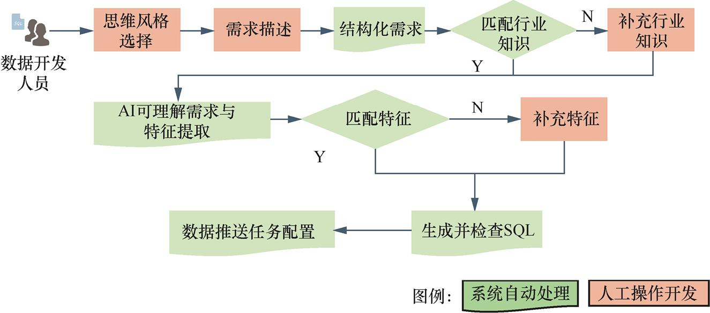
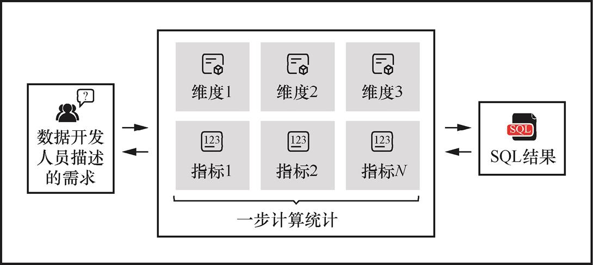
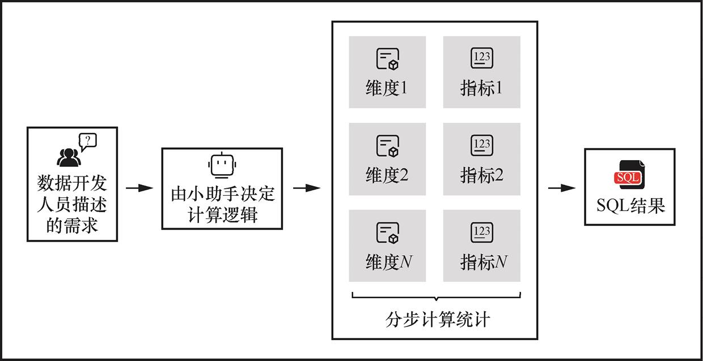
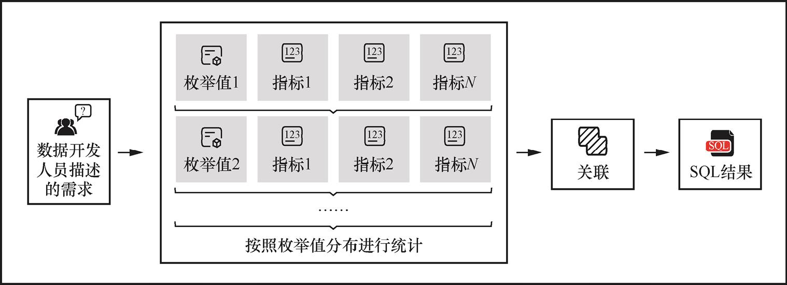
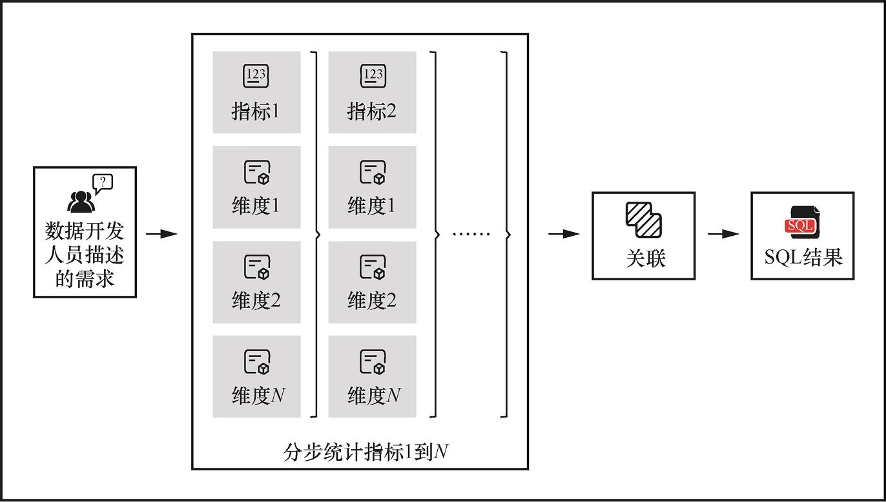
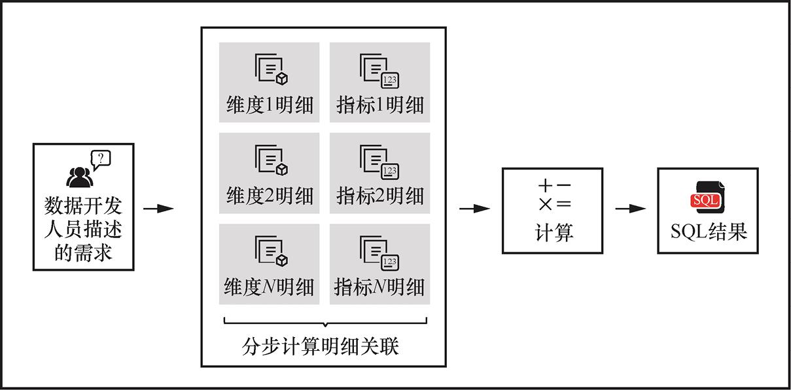
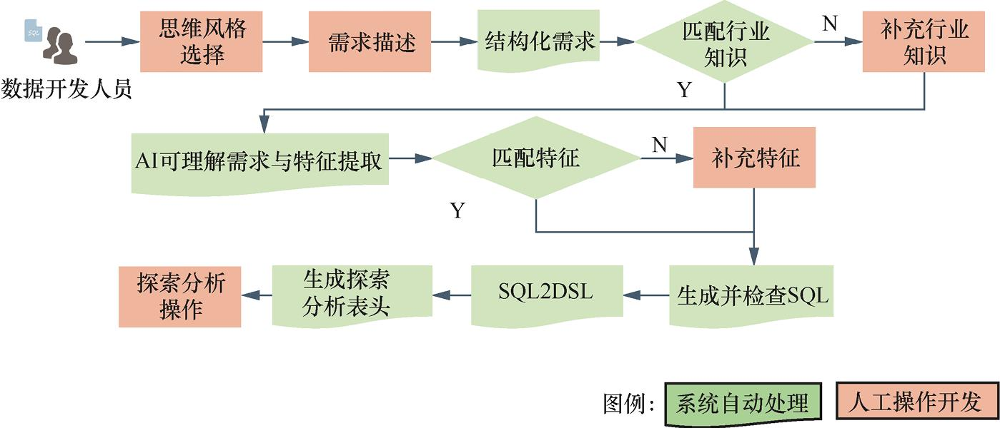
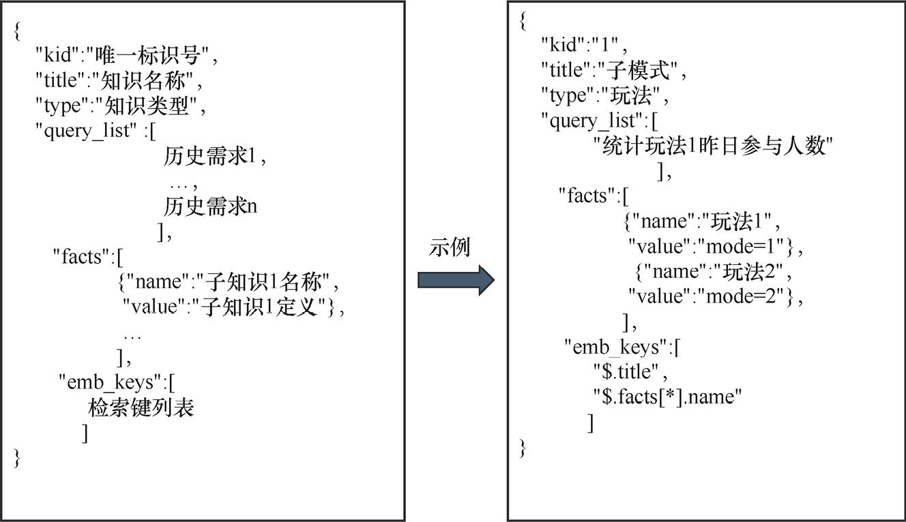

# 学习腾讯游戏数据团队的《大模型工程化：AI驱动下的数据体系》
## 安装环境
1. 安装Python
````bash
conda create -n AI-data python=3.12.1
conda activate AI-data
````
2. 安装OpenAI依赖库
```bash
conda install openai
#验证是否安装成功
python -c "import openai;print('install openai success')"
```
3. 安装LangChain
```bash
pip install  langchain  langchain-experimental langchain-community langchain-core langchain_openai
# 验证是否安装成功
 python -c "from langchain_openai import OpenAI; chat=OpenAI();print('install LangChain success')"
```
4. 安装FastAPI、Uvicorn
```bash
pip install fastapi uvicorn
```

## 《智能助手系统架构》设计

1. 需求理解模块\
需求理解模块的功能主要是基于数据开发描述的原始需求，结合行业知识和库表元数据信息，根据开发人员选择的不同风格，生成相应风格的AI可理解的需求。
需求理解模块的核心子功能包含6个部分，分别是选择风格、结构化需求、匹配行业知识、匹配表、获取表元数据和拼接AI可理解需求的提示词。
- 选择风格：从语义层面理解需求存在多种方式，例如，对于一个需求可以按照不同维度方式理解，将其拆分成和维度个数一致的子需求后再合并；也可以按不同指标方式理解，将其拆分成和指标个数一致的多个子需求后再合并。因此，为了确保AI对需求的理解与开发人员尽可能一致，开发人员需要选择其预期的理解风格。
- 结构化需求：将自然语言描述的需求结构化为类似Excel工作表的格式，其中包含需求表头、数据示例、逻辑说明和备注补充。
- 匹配行业知识：在需求表达中融入更全面的行业知识，让AI能够更准确地理解需求。
- 匹配表：如果数据开发人员在描述需求的时候提及具体的表名，此时应从库表资产中匹配相应的资产表。
- 获取表元数据：通过匹配的表名去数据资产管理平台中获取相应表的元数据，包含表描述和字段描述。这些元数据有助于AI对需求准确理解。
- 拼接AI可理解需求的提示词：将结构化后的需求、行业知识和表元数据这3部分信息补充到相应风格的AI可理解需求的基础提示词中，以生成AI可理解的需求。

2. SQL生成模块\
SQL生成模块的功能是为每个数据包生成相应的SQL代码。首先，提取数据包中的特征名称并匹配相应的代码片段，如果无法匹配，算法会根据特征名称结合库表资产和特征资产元数据推荐关联性较高的特征；其次，结合数据包信息、特征代码片段、特征对应表的元数据和SQL生成的基础提示词，拼接成用于生成SQL的提示词；最后，输入大模型生成相应数据包的SQL代码，并通过执行引擎接口校验语法的准确性。
SQL生成模块的核心子功能包括7个部分，分别是提取特征名称、匹配特征、推荐库表和特征、获取表和特征元数据、拼接生成SQL的提示词、生成SQL和语法校验。
- 提取特征名称：AI从语义层面识别获取相应数据包的数据所需的关键特征名称。特征的代码片段用于辅助生成该数据包的SQL代码。
- 匹配特征：依据AI提取的特征名称，从特征资产库中匹配出名称一致的特征。首先，根据AI提取的特征名称在特征资产库中找到最相似的5个特征；其次，对AI提取的特征名称和最相似的5个特征名称分别进行正则化处理，包括去除停用词、日期和数字，例如，去除“的、每日、双周、minute、2024”；最后，如果正则化处理后的特征名称和推荐的特征名称完全一致，就认为匹配成功。
- 推荐库表和特征：如果上一步匹配未成功，算法将根据AI提取的特征名称匹配库表和特征资产中较相似的信息，并交由开发人员确认。
- 获取表和特征元数据：基于开发人员确认的表或特征，从资产管理平台获取相应库表及特征的元数据信息。
- 拼接生成SQL的提示词：将数据包信息、特征名称、特征代码片段、特征所使用表的元数据这4部分信息补充到生成SQL的基础提示词中，以生成相应数据包的SQL代码。
- 生成SQL：将拼接后的提示词传入大模型中以生成相应的SQL代码。
- 语法校验：使用生成的SQL在执行引擎中执行EXPLAIN语句，以检验语法的正确性。如果语法不正确，则系统将对应的错误信息返回给开发人员。
3. 代码生成应用流程\


代码生成应用的核心流程可以分为10个步骤，分别是思维风格选择、需求描述、结构化需求、匹配行业知识、补充行业知识、AI可理解需求与特征提取、匹配特征、补充特征、生成并检查SQL以及数据推送任务配置。
### 思维风格选择
1. 单步思维：AI根据数据开发人员描述的需求直接生成SQL代码，而无须将需求拆解成多个数据包。此思维风格常用于处理相对简单的需求。

2. 通用思维：AI根据其理解将数据开发人员描述的需求智能地拆解成多个数据包。此思维风格常用于开发人员在编码前缺乏明确思路，期望AI提供代码生成思路的场景。

3. 分枚举值统计：AI先根据不同维度的枚举值拆解出各个结果指标，最后再合并这些结果指标。此思维风格常用于维度逻辑较为复杂的需求。

4. 分指标统计：AI先根据所有维度拆解出各个结果指标，最后再关联不同的结果指标。此思维风格常用于指标逻辑数量较多且逻辑复杂的需求。

5. 明细关联再统计：AI先提取不同的明细数据，最后将它们关联得到最终的统计结果指标。此思维风格常用于包含多层明细数据嵌套结构的需求。


## 《探索分析应用》

探索分析应用在技术实现上基本复用了代码生成应用的插件体系。在生成并检查SQL的前置流程中，探索分析应用与代码生成应用保持高度一致。然而，探索分析应用的主要特色在于其能够将SQL代码转换为领域特定语言（Domain Specific Language，DSL），并实现与下游可视化系统的无缝对接。此过程有效地支持了从自然语言到探索分析展示的转换功能，极大地增强了用户体验和应用的实用性。
本节重点介绍探索分析应用的差异化能力，分别是SQL2DSL、生成探索分析表头和探索分析操作。

## 《需求理解算法的设计原理》
需求理解算法的核心组件是业务知识库和需求理解链路。
### 构建业务知识库
1. 业务知识定义\
通过设计一套统一的业务知识库，方便管理不同形式的业务知识。

- kid（唯一标识号）：知识的编号，用于区分知识。
- title（知识名称）：一大类知识的统称，一般会被向量化，用作检索索引。
- type（知识类型）：知识的分类，根据具体场景设置不同分类体系，可用于辅助检索。
- query_list（历史需求列表）：知识点的历史需求描述列表，可用于辅助检索。
- facts:name（子知识名称）：具体的知识点名称，一般会用作检索索引。
- facts:value（子知识定义）：对知识点的解释，对于复杂知识，可以使用SQL查询。
- emb_keys（检索键列表）：知识结构中，用作检索的键列表，后续会拉取这些键用作索引。
2. 业务知识抽取\
在确定知识管理的模板后，可以对存量历史知识进行抽取，并按模板进行组织。对于结构化和半结构化的知识，可以基于规则或深度模型（如BERT）进行抽取。对于半结构化的知识，可以使用提示工程（Prompt Engineering）技术借助大模型抽取。\
基于提示工程技术，可以提升大语言模型处理复杂任务场景的能力，如问答和算术推理能力。使用少样本提示和链式思考提示技术，可以使大模型从聊天记录中抽取业务知识。可以从其他非结构化数据中抽取业务知识，如开发文档、历史需求描述等。抽取的业务知识经过专家人工审核后，可以存入业务知识库。

### 构建需求理解链路\
- Query预处理模块：对需求进行简单的规则处理，可参考传统Query理解算法。
   - 传统Query预处理：对输入进行简单的规则处理，方便后续进一步分析和处理。预处理过程主要包括归一化（大小写转换、繁简体转换、符号表情移除和全半角转换等）、长度截断（对过长查询进行截断处理等）和运营审核（对特殊情况进行审核、干预等）。
- 知识检索模块：对需求进行向量化后，从业务知识库中检索必要的历史知识。
- 需求澄清模块：针对需求的新增知识，进行多轮对话，通过用户补充澄清。
- 需求改写模块：结合历史知识和新增知识，将用户需求改写成清晰的需求。
- 业务知识抽取模块：对需求澄清模块产生的多轮对话进行新增知识抽取
